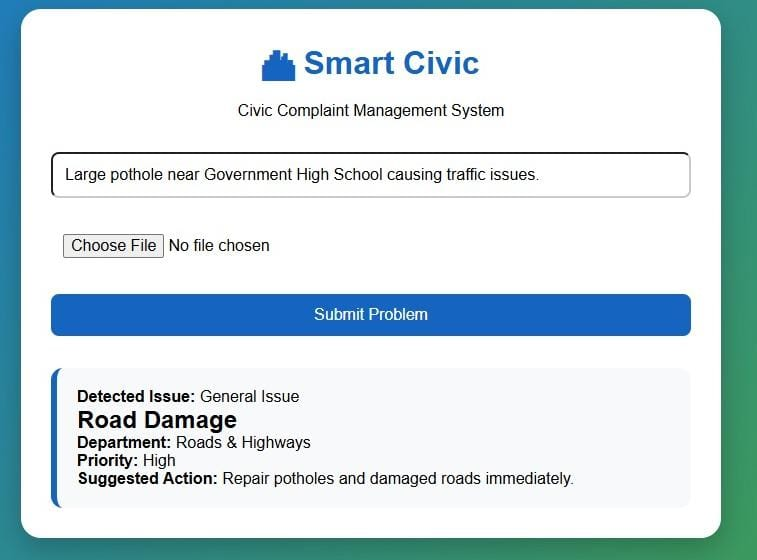
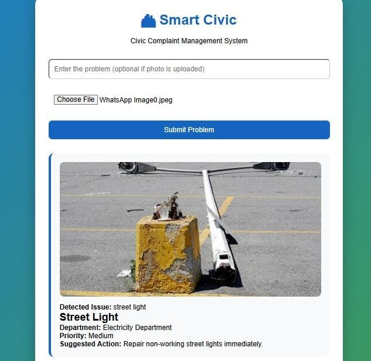

# 🏙 Smart Civic

**AI-Powered Civic Complaint Management System**

Smart Civic is a web-based civic complaint management system that enables citizens to report civic issues through text or by uploading images. The system automatically identifies the issue, retrieves the most relevant civic rule using **Retrieval-Augmented Generation (RAG)**, and provides the responsible department, priority level, and suggested action.

This project supports **United Nations Sustainable Development Goal (SDG) 11 – Sustainable Cities and Communities**.

---

## Problem Statement

Citizens often face delays in reporting civic problems such as potholes, garbage accumulation, broken street lights, and water leaks. Traditional complaint systems require manual categorization, which slows down routing complaints to the appropriate municipal department.

Smart Civic simplifies this process by automatically recognizing the reported issue from text or images and providing an instant, structured response.

---

## Features

- 📝 Text-based complaint submission
- 📷 Image upload and automatic issue detection
- 🔍 RAG-based civic rule retrieval
- 🏢 Automatic department assignment
- ⚠️ Priority detection
- 💡 Suggested action for each complaint
- 🌐 Responsive web interface

---

## Technologies Used

### AI Technologies

- **RAG (Retrieval-Augmented Generation)**
- **Computer Vision (CLIP)** for image recognition
- **Sentence Transformers** for text embeddings
- **FAISS** for vector similarity search

### Development Technologies

- Python
- Flask
- HTML5
- CSS3
- JavaScript
- Pillow (PIL)

---

## Project Workflow

1. User enters a complaint or uploads an image.
2. The uploaded image is analyzed using **CLIP**.
3. The detected issue (or entered text) is converted into embeddings.
4. **FAISS** retrieves the most relevant civic rule from the knowledge base.
5. The system displays:
   - Detected Issue
   - Complaint Category
   - Responsible Department
   - Priority Level
   - Suggested Action

---

## Folder Structure

```text
Smart-Civic-AI/
│
├── app.py
├── build_index.py
├── requirements.txt
│
├── knowledge/
│   └── civic_rules.txt
│
├── templates/
│   └── index.html
│
├── static/
│   ├── style.css
│   ├── script.js
│   └── uploads/
│
├── index.faiss (generated)
└── documents.pkl (generated)
```

---

## Installation

### 1. Install dependencies

```bash
python -m pip install -r requirements.txt
```

### 2. Build the RAG index

```bash
python build_index.py
```

### 3. Run the project

```bash
python app.py
```

Open your browser and visit:

```
http://127.0.0.1:5000
```

---

## Example Use Cases

| User Input | System Output |
|------------|---------------|
| Pothole image | Road Damage → Roads & Highways → High Priority |
| Garbage image | Garbage → Sanitation Department → Medium Priority |
| Street light image | Street Light → Electricity Department |
| Water leak image | Water Supply Department → High Priority |

---
## Project Screenshots

### Home Page

The Smart Civic home page provides a clean and user-friendly interface where users can enter a civic complaint, upload an image, and submit it for analysis.


### Text-Based Complaint

Users can report civic issues by entering a short description. The system analyzes the complaint and identifies the appropriate category, department, priority level, and suggested action.



### Image-Based Detection

Users can upload an image of a civic issue, such as a pothole, garbage pile, broken street light, or water leak. The system automatically detects the issue and displays the corresponding department, priority level, and recommended action.


---
## Future Enhancements

- 📍 GPS location detection
- 🌐 Multilingual complaint support
- 📊 Admin dashboard
- 🔔 SMS/Email notifications
- ☁️ Cloud deployment
- 📈 Complaint tracking and analytics
